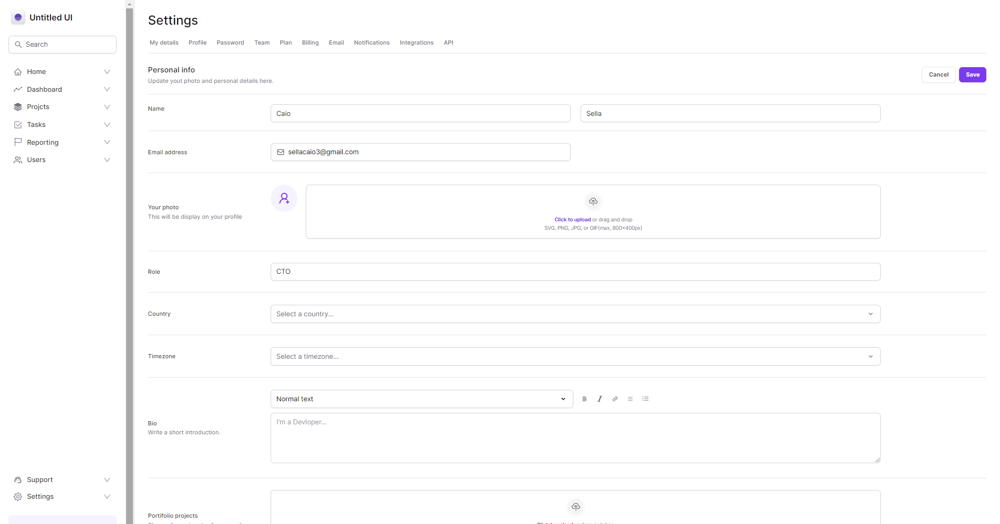

<h1 align=center> Untitled <i style='color: #7F00FF; font-size:30px'; >UI</i></h1>



>projeto finalizado | Front-End only

<h3> Executar em seu computador: </h3>

```
npm i
npm run dev
```
<p>acesser nesse <a href='[https://vercel.com/caiozin1/tailwind-next](https://tailwind-next-lake.vercel.app/)https://tailwind-next-lake.vercel.app/'>Link</p>
